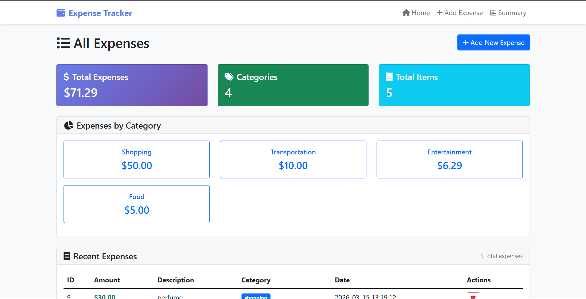
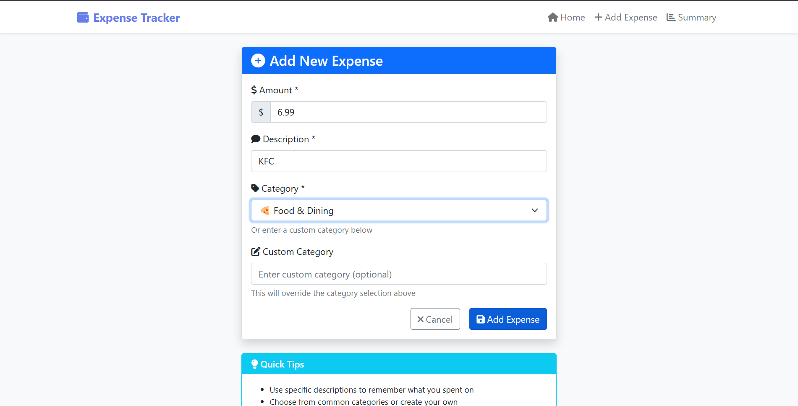
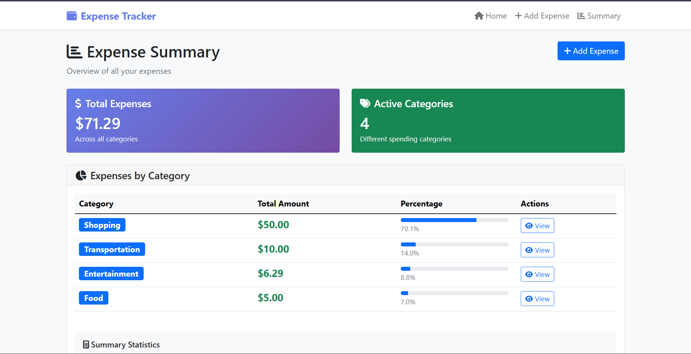
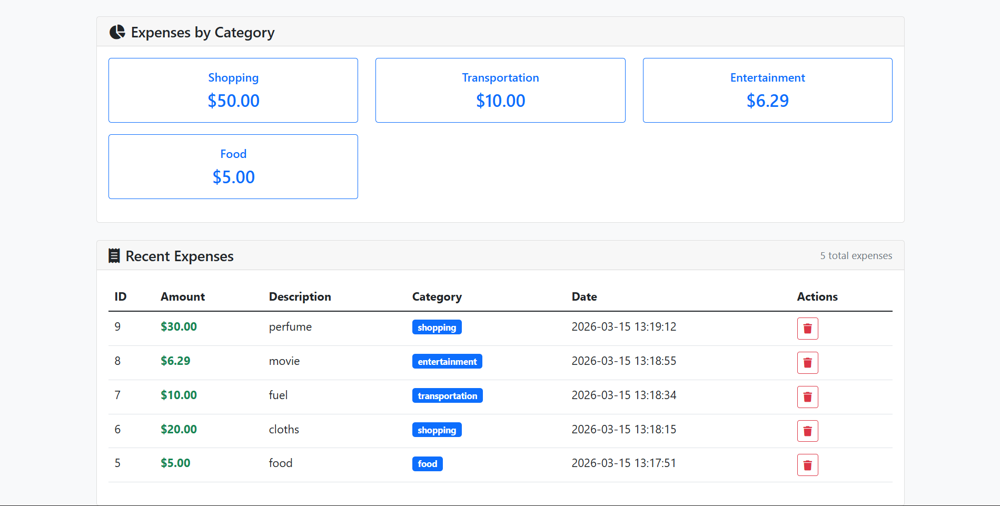

# Expense Tracker Web Application

A modern web-based expense tracking application built with Flask and SQLite.

## Features

- **Web Interface**: Clean, responsive web UI with Bootstrap styling
- **Add Expenses**: Easy form to add new expenses with categories
- **View Expenses**: List all expenses with sorting and filtering
- **Category Management**: View expenses by category with summaries
- **Expense Summary**: Comprehensive spending analysis and statistics
- **Delete Expenses**: Remove expenses with confirmation
- **SQLite Database**: Persistent storage with automatic database creation

## Demo
https://expense-tracker-web-873j.onrender.com

## Screenshots

### Home


### Add Expense


### Summary


### Category


## Installation

1. Clone or download this repository
2. Install dependencies:
   ```bash
   pip install -r requirements.txt
   ```
3. Make sure you have Python 3.6+ installed

## Running the Application

### Web Application (Recommended)
```bash
python main.py
```

Then open your browser and go to: `http://localhost:5000`

### Features Overview

#### Dashboard (Home Page)
- View all expenses in a table format
- See summary cards with total expenses, categories, and item count
- Quick access to category breakdowns
- Add new expenses directly from the dashboard

#### Add Expense
- Form with amount, description, and category fields
- Pre-defined categories (Food, Transportation, Entertainment, etc.)
- Custom category option
- Form validation and error handling

#### Category View
- Filter expenses by specific categories
- Category-specific summaries and statistics
- Easy navigation back to main dashboard

#### Summary Page
- Overall spending analysis
- Category breakdown with percentages
- Visual progress bars for spending distribution
- Statistical insights (highest/lowest categories, averages)

## Database

The application uses SQLite database (`expenses.db`) which is automatically created. The database contains:

- **expenses** table with columns:
  - `id`: Unique identifier (auto-increment)
  - `amount`: Expense amount (REAL)
  - `description`: Description (TEXT)
  - `category`: Category (TEXT)
  - `date`: Timestamp (TEXT)

## API Endpoints

- `GET /` - Dashboard with all expenses
- `GET/POST /add` - Add new expense form
- `POST /delete/<id>` - Delete expense by ID
- `GET /category/<category>` - View expenses by category
- `GET /summary` - Expense summary and analysis

## Technology Stack

- **Backend**: Python Flask
- **Database**: SQLite
- **Frontend**: HTML5, Bootstrap 5, Font Awesome icons
- **Styling**: Custom CSS with responsive design

## Development

The application runs in debug mode by default. For production deployment, set `debug=False` in `main.py`.

## Browser Support

Works on all modern browsers with responsive design for mobile devices.

## License

This project is open source and available under the MIT License.
